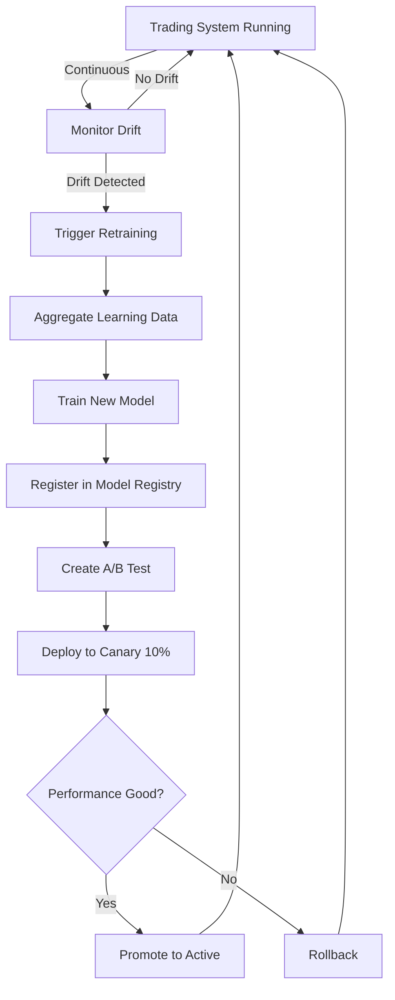

# Phase 4: Advanced Self-Evolution & Production Readiness

## Overview

Phase 4 builds on Phase 3's self-evolution foundation by adding production-ready features for safe, continuous model improvement:

- **Feature Test Suite**: Comprehensive testing of complete workflows
- **A/B Testing Framework**: Safe model validation before deployment
- **Model Registry**: Version management and deployment tracking
- **Drift Detection**: Monitoring for feature, prediction, and concept drift

## Architecture

```
┌─────────────────────────────────────────────────────────────────┐
│                    Phase 4 Self-Evolution System                │
├─────────────────────────────────────────────────────────────────┤
│                                                                 │
│  ┌──────────────┐    ┌──────────────┐    ┌──────────────┐    │
│  │  Phase 3     │    │   Phase 4    │    │   Phase 4    │    │
│  │  Components  │───▶│  Production  │───▶│   Safety     │    │
│  │              │    │   Features   │    │   Systems    │    │
│  └──────────────┘    └──────────────┘    └──────────────┘    │
│         │                     │                    │           │
│         ▼                     ▼                    ▼           │
│  ┌──────────────┐    ┌──────────────┐    ┌──────────────┐    │
│  │  Learning    │    │  A/B Testing │    │    Drift     │    │
│  │  Aggregator  │    │  Framework   │    │  Detection   │    │
│  │              │    │              │    │              │    │
│  │  Retraining  │    │    Model     │    │  Monitoring  │    │
│  │   Trigger    │    │   Registry   │    │   Alerts     │    │
│  │              │    │              │    │              │    │
│  │  Evolution   │    │   Canary     │    │  Automatic   │    │
│  │ Coordinator  │    │  Deployment  │    │  Rollback    │    │
│  └──────────────┘    └──────────────┘    └──────────────┘    │
│                                                                 │
└─────────────────────────────────────────────────────────────────┘
```

## Components

### 1. Feature Test Suite

**Location**: `PassiveIncomeMaximizer/server/tests/feature/`

**Purpose**: Validate complete workflows across multiple components

**Test Coverage**:
- ✅ Prediction storage and retrieval
- ✅ Learning data aggregation (prediction-outcome matching)
- ✅ Retraining trigger logic
- ✅ Self-evolution cycle orchestration
- ✅ Data export for training

**Example Test**:
```typescript
describe('Feature: Learning Data Aggregation', () => {
  it('should match prediction with outcome within 24h window', async () => {
    // Create matched prediction-outcome pair
    await createMatchedPredictionOutcome('AAPL', 0.85, true);

    // Aggregate learning data
    const dataset = await learningDataAggregator.aggregateLearningData('AAPL', 1);

    expect(dataset.metadata.totalSamples).toBeGreaterThan(0);
    expect(dataset.samples[0].label).toBe('correct');
  });
});
```

**Run Tests**:
```bash
cd PassiveIncomeMaximizer
npm test -- feature/finvec-caelum-integration.feature.test.ts
```

---

### 2. A/B Testing Framework

**Location**: `PassiveIncomeMaximizer/server/services/finvec/ab-testing.ts`

**Purpose**: Safely validate new models before full deployment

**Key Features**:
- **Traffic Splitting**: Route X% of traffic to treatment model
- **Statistical Testing**: Two-sample t-test with configurable confidence
- **Early Stopping**: Automatically rollback if treatment degrades
- **Success Metrics**: Accuracy, profit%, Sharpe ratio, win rate

**Usage Example**:
```typescript
import { abTesting, SuccessMetric } from './ab-testing';

// Create experiment
const experiment = await abTesting.createExperiment({
  name: 'v4.5_accuracy_improvement',
  description: 'Testing new ensemble architecture',
  controlModel: 'v4.4',
  treatmentModel: 'v4.5',
  trafficSplit: 0.1,  // 10% treatment, 90% control
  duration: 24,        // 24 hours
  minSampleSize: 100,
  successMetric: SuccessMetric.ACCURACY,
  confidenceLevel: 0.95,
  earlyStoppingThreshold: 5.0  // Stop if 5% worse
});

// Start experiment
await abTesting.startExperiment(experiment.id);

// In prediction service:
const variant = abTesting.assignVariant(request, experiment.id);
const modelVersion = variant === 'treatment' ? 'v4.5' : 'v4.4';

// After experiment completes:
const result = await abTesting.analyzeExperiment(experiment.id);

if (result.recommendation === Recommendation.PROMOTE_TREATMENT) {
  await modelRegistry.setActiveModel('v4.5');
}
```

**Decision Criteria**:
- **Promote**: Treatment is statistically better (p < 0.05)
- **Keep Control**: Treatment is worse
- **Continue Testing**: Insufficient evidence
- **Rollback**: Treatment significantly degrades performance

---

### 3. Model Registry

**Location**: `PassiveIncomeMaximizer/server/services/finvec/model-registry.ts`

**Purpose**: Manage model versions, metadata, and deployment status

**Key Features**:
- **Version Management**: Register, track, and compare model versions
- **Deployment Tracking**: Active, canary, shadow, deprecated, archived
- **Performance History**: Track accuracy, loss, Sharpe ratio over time
- **Rollback Support**: One-command rollback to previous version
- **Model Comparison**: Automated comparison reports

**Usage Example**:
```typescript
import { modelRegistry, DeploymentStatus } from './model-registry';

// Initialize registry
await modelRegistry.initialize();

// Register new model
await modelRegistry.registerModel({
  version: 'v4.5',
  timestamp: new Date(),
  trainingConfig: {
    modelType: 'v4_ensemble',
    architecture: '2x2_lstm_transformer',
    hyperparameters: { learning_rate: 0.001, batch_size: 32 },
    trainingDataPath: '/data/training/v4.5',
    checkpointPath: '/models/v4.5/checkpoint.pth',
    trainingDuration: 7200,
    gpuUsed: 'RTX 4090'
  },
  performance: {
    trainLoss: 0.32,
    valLoss: 0.35,
    testLoss: 0.36,
    trainAccuracy: 0.82,
    valAccuracy: 0.78,
    testAccuracy: 0.77,
    precision: 0.76,
    recall: 0.75,
    f1Score: 0.755,
    sharpeRatio: 1.8,
    winRate: 0.68
  },
  datasetInfo: {
    totalSamples: 10000,
    trainSamples: 7000,
    valSamples: 1500,
    testSamples: 1500,
    symbols: ['AAPL', 'MSFT', 'GOOGL'],
    dateRange: { start: new Date('2024-01-01'), end: new Date('2024-10-01') },
    dataQuality: 0.92
  },
  deploymentStatus: DeploymentStatus.REGISTERED,
  tags: ['production-candidate', 'ensemble', 'high-accuracy']
});

// Compare models
const comparison = await modelRegistry.compareModels('v4.4', 'v4.5');
console.log(comparison.recommendation);
// "v4.5 shows moderate improvement (+2.5%). Recommend A/B testing."

// Deploy to canary
await modelRegistry.setCanaryModel('v4.5');

// If canary succeeds, promote to active
await modelRegistry.promoteCanaryToActive('v4.5');

// If issues arise, rollback
await modelRegistry.rollbackToVersion('v4.4', 'Accuracy degradation in production');
```

**Deployment States**:
1. **REGISTERED**: Model registered but not deployed
2. **CANARY**: Deployed to 5-10% of traffic
3. **ACTIVE**: Primary production model
4. **SHADOW**: Running in parallel (not affecting users)
5. **DEPRECATED**: Marked for removal
6. **ARCHIVED**: Archived and no longer accessible

---

### 4. Drift Detection System

**Location**: `PassiveIncomeMaximizer/server/services/finvec/drift-detector.ts`

**Purpose**: Detect changes in data/model behavior that may require retraining

**Drift Types**:

#### 4.1 Feature Drift
**What it detects**: Changes in input feature distributions

**Example**: Stock price volatility increases significantly, causing feature distributions to shift

**Method**: Jensen-Shannon divergence between baseline and current feature distributions

**Usage**:
```typescript
import { driftDetector } from './drift-detector';

// Set baseline (e.g., features from last 30 days)
driftDetector.setFeatureBaseline('AAPL', historicalFeatures);

// Check for drift
const report = driftDetector.detectFeatureDrift(currentFeatures, historicalFeatures);

if (report.driftDetected && report.severity === 'high') {
  console.log(report.recommendation);
  // "Critical feature drift detected in 'volatility'. Consider retraining immediately."
}
```

#### 4.2 Prediction Drift
**What it detects**: Changes in model output distributions

**Example**: Model confidence scores shift lower/higher over time

**Method**: Statistical comparison of prediction confidence distributions

**Usage**:
```typescript
// Detect prediction drift over last 7 days
const report = await driftDetector.detectPredictionDrift(recentPredictions, 7);

if (report.driftDetected) {
  console.log(`Prediction drift: ${report.details.percentageChange.toFixed(1)}% change`);
}
```

#### 4.3 Concept Drift
**What it detects**: Changes in relationship between features and target (accuracy degradation)

**Example**: Market regime change causes model accuracy to drop from 75% to 60%

**Method**: CUSUM (Cumulative Sum) algorithm on accuracy timeseries

**Usage**:
```typescript
// Detect concept drift using accuracy history
const accuracyHistory = [0.75, 0.76, 0.74, 0.72, 0.68, 0.65, 0.62];
const report = driftDetector.detectConceptDrift(accuracyHistory);

if (report.driftDetected) {
  console.log(report.recommendation);
  // "Accuracy has decreased by 15%. Retrain model with recent data."
}
```

**Monitoring**:
```typescript
// Continuous drift monitoring for all symbols
const driftReports = await driftDetector.monitorDrift(['AAPL', 'MSFT', 'GOOGL'], 7);

for (const [symbol, reports] of driftReports.entries()) {
  for (const report of reports) {
    if (report.severity === 'high' || report.severity === 'critical') {
      // Alert and trigger retraining
      await retrainingTrigger.triggerRetrain([symbol], report.recommendation);
    }
  }
}
```

---

## Testing Pyramid

Phase 4 follows the testing pyramid strategy:

```
        /\
       /E2E\        5% - End-to-end tests
      /------\      - Complete user workflows
     /Feature\      25% - Feature tests (NEW in Phase 4)
    /----------\    - Complete feature workflows
   /    Unit    \   70% - Unit tests
  /--------------\  - Individual function testing
```

**Unit Tests** (70%): Fast, isolated function testing
- Test individual functions: `calculateAccuracy()`, `matchPredictions()`
- Mock all dependencies
- Run in milliseconds

**Feature Tests** (25%): Medium-speed, real dependencies
- Test complete features: "Prediction storage → matching → accuracy calculation"
- Use real database (test environment)
- Run in seconds

**E2E Tests** (5%): Slow, critical workflows only
- Test complete user journeys: "Request prediction → execute trade → track outcome → retrain"
- Use all real services
- Run in minutes

---

## Phase 4 Workflow

### Complete Self-Evolution Cycle with Phase 4



**Step-by-Step**:

1. **Drift Monitoring** (Continuous)
   ```typescript
   // Run every hour
   const driftReports = await driftDetector.monitorDrift(symbols, 7);
   ```

2. **Retraining Trigger** (When drift detected OR accuracy < threshold)
   ```typescript
   const decision = await retrainingTrigger.shouldTrigger(['AAPL']);
   if (decision.shouldRetrain) {
     await startRetrainingPipeline();
   }
   ```

3. **Model Training** (Python - FinVec)
   ```bash
   cd finvec
   .venv/bin/python scripts/train_v4.py --config configs/retrain.yaml
   ```

4. **Model Registration**
   ```typescript
   await modelRegistry.registerModel({
     version: 'v4.6',
     performance: { testAccuracy: 0.79, ... },
     ...
   });
   ```

5. **A/B Testing**
   ```typescript
   const experiment = await abTesting.createExperiment({
     controlModel: 'v4.5',
     treatmentModel: 'v4.6',
     trafficSplit: 0.1,
     duration: 24
   });
   await abTesting.startExperiment(experiment.id);
   ```

6. **Decision**
   ```typescript
   const result = await abTesting.analyzeExperiment(experiment.id);

   if (result.recommendation === 'promote_treatment') {
     await modelRegistry.setActiveModel('v4.6');
   } else if (result.recommendation === 'rollback') {
     await modelRegistry.rollbackToVersion('v4.5', 'A/B test failed');
   }
   ```

---

## Integration with Existing Systems

### FinVec Trading Service (finvec/)

**Location**: `finvec/services/finvec_trading_service.py`

**Changes Needed**:
```python
# Add Phase 4 integration
from services.drift_monitor import DriftMonitor
from services.model_version_manager import ModelVersionManager

class FinVecTradingService:
    def __init__(self):
        # ... existing initialization ...

        # Phase 4 components
        self.drift_monitor = DriftMonitor()
        self.model_version_manager = ModelVersionManager()

    async def check_model_health(self):
        """Check for drift and trigger retraining if needed"""
        drift_report = await self.drift_monitor.check_drift(self.active_symbols)

        if drift_report.requires_retraining:
            logger.warning("Drift detected, triggering retraining")
            await self.trigger_retraining(drift_report.affected_symbols)
```

### Caelum PIM (PassiveIncomeMaximizer/)

**Location**: `PassiveIncomeMaximizer/server/services/finvec/orchestrator.ts`

**Changes Needed**:
```typescript
import { driftDetector } from './drift-detector';
import { modelRegistry } from './model-registry';
import { abTesting } from './ab-testing';

export class FinVecOrchestrator {
  async monitorAndEvolve() {
    // Check drift
    const driftReports = await driftDetector.monitorDrift(this.symbols, 7);

    // Trigger retraining if needed
    for (const [symbol, reports] of driftReports.entries()) {
      if (reports.some(r => r.severity === 'high')) {
        await this.triggerRetraining([symbol]);
      }
    }

    // Check active experiments
    const experiments = abTesting.listExperiments();
    for (const exp of experiments) {
      if (exp.status === 'running') {
        const result = await abTesting.analyzeExperiment(exp.id);
        // Handle result...
      }
    }
  }
}
```

---

## Configuration

### A/B Testing Config
```typescript
{
  trafficSplit: 0.1,          // 10% treatment
  duration: 24,               // 24 hours
  minSampleSize: 100,
  successMetric: 'accuracy',
  confidenceLevel: 0.95,      // 95% confidence
  earlyStoppingThreshold: 5.0 // Stop if 5% worse
}
```

### Drift Detection Config
```typescript
{
  featureDriftThreshold: 0.1,      // 10% JS divergence
  predictionDriftThreshold: 0.15,  // 15% distribution change
  conceptDriftThreshold: 0.05,     // 5% accuracy change
  monitoringInterval: 3600000,     // 1 hour
  lookbackDays: 7
}
```

### Model Registry Config
```typescript
{
  registryPath: '/tmp/model_registry.json',
  maxArchivedModels: 10,
  autoArchiveAfterDays: 90,
  requireApprovalForProduction: false
}
```

---

## Metrics & Monitoring

### Key Metrics to Track:

**Model Performance**:
- Test accuracy (target: >75%)
- Sharpe ratio (target: >1.5)
- Win rate (target: >65%)
- Average profit per trade

**Drift Metrics**:
- Feature drift score (alert if >0.15)
- Prediction drift score (alert if >0.20)
- Accuracy trend (alert if -10% over 7 days)

**Experiment Metrics**:
- Active experiments count
- Successful promotions rate
- Rollback frequency
- Average experiment duration

**Deployment Metrics**:
- Model deployment frequency
- Rollback count
- Canary → production promotion rate
- Model version diversity

---

## Next Steps

### Immediate (Phase 4 Completion):
1. ✅ Feature test suite implemented
2. ✅ A/B testing framework created
3. ✅ Model registry implemented
4. ✅ Drift detection system built
5. ⏳ Run feature tests and validate
6. ⏳ Integrate with FinVec trading service
7. ⏳ Set up monitoring dashboards

### Short-term (Phase 5 - Future):
1. WebSocket streaming for real-time data (118 symbols)
2. Multi-model ensemble management
3. Transfer learning between symbols
4. Hyperparameter optimization (Bayesian)
5. Automated feature engineering
6. Real-time model calibration

### Long-term (Production Scaling):
1. Distributed training (multi-GPU, multi-node)
2. Model serving optimization (TensorRT, ONNX)
3. Cost optimization (GPU utilization)
4. Compliance & audit logging
5. Explainability & interpretability
6. Advanced meta-learning

---

## Summary

Phase 4 transforms the FinVec self-evolution system from experimental to production-ready:

**Before Phase 4**:
- ✅ Learning data aggregation
- ✅ Retraining trigger logic
- ✅ Basic evolution coordinator
- ❌ No safe deployment strategy
- ❌ No version management
- ❌ No drift monitoring
- ❌ Limited testing

**After Phase 4**:
- ✅ Comprehensive feature testing
- ✅ A/B testing for safe deployments
- ✅ Model registry with version control
- ✅ Drift detection and monitoring
- ✅ Automatic rollback on degradation
- ✅ Production-ready workflows
- ✅ Statistical validation

**Key Benefits**:
- **Safety**: A/B testing prevents bad models from reaching production
- **Reliability**: Drift detection catches issues early
- **Traceability**: Model registry tracks all versions and deployments
- **Quality**: Feature tests ensure workflows work end-to-end
- **Confidence**: Statistical validation before deployment

Phase 4 enables **continuous, safe, automated model improvement** in production! 🚀
